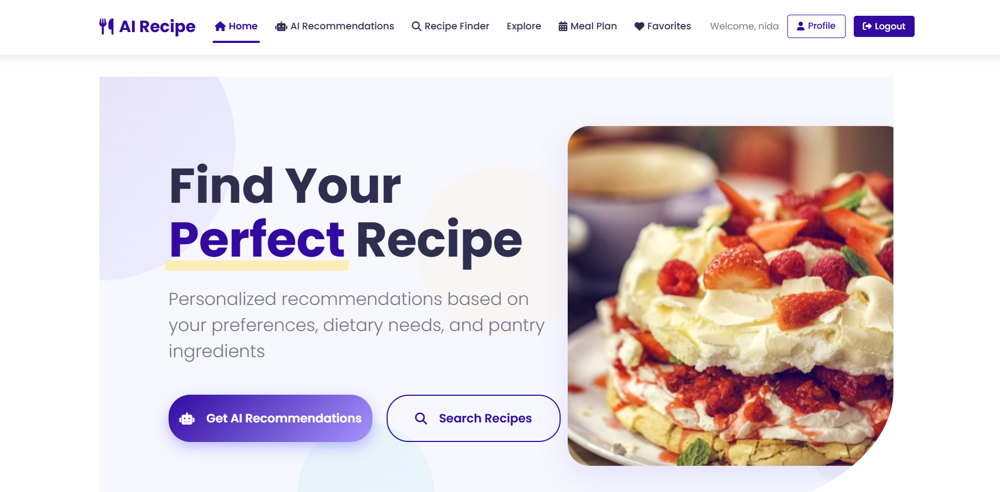
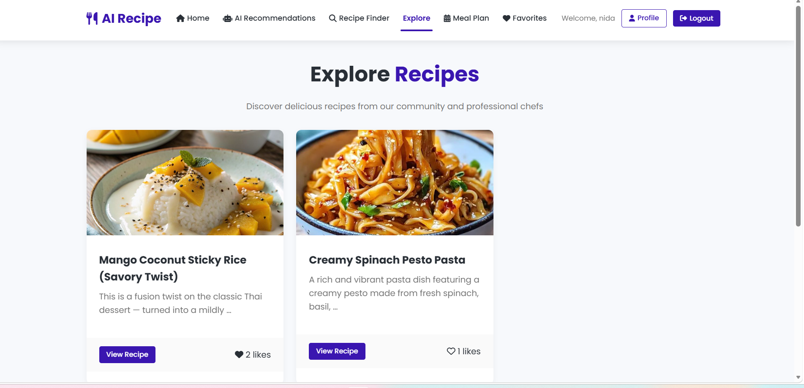
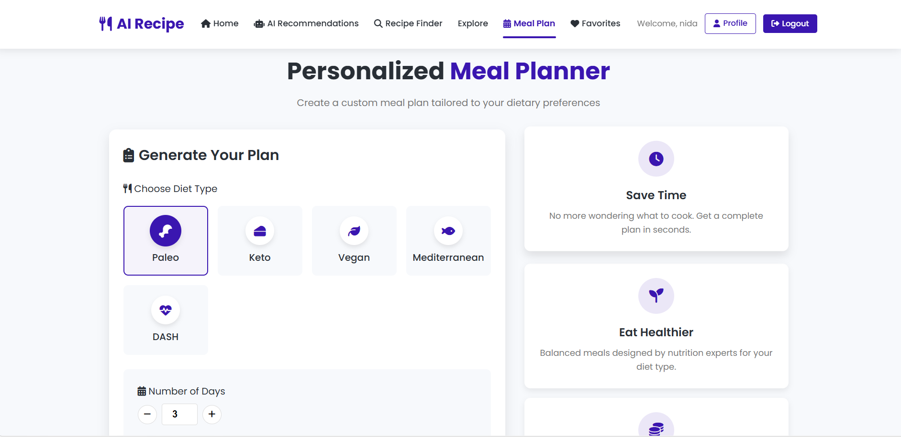
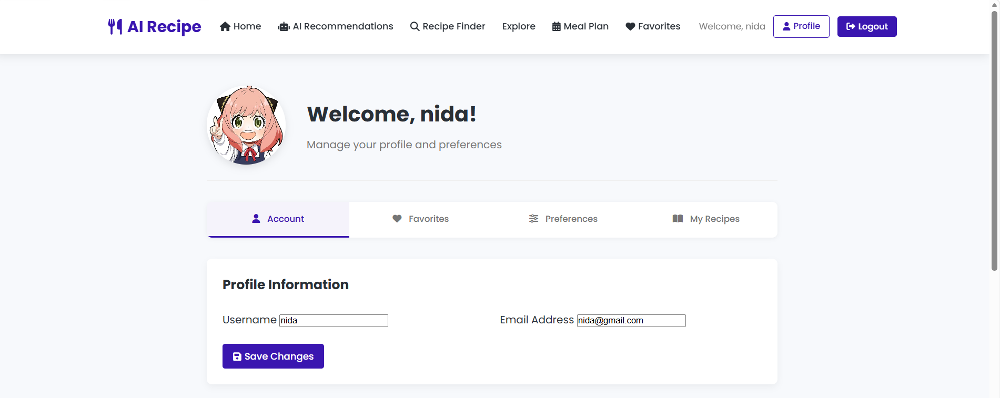
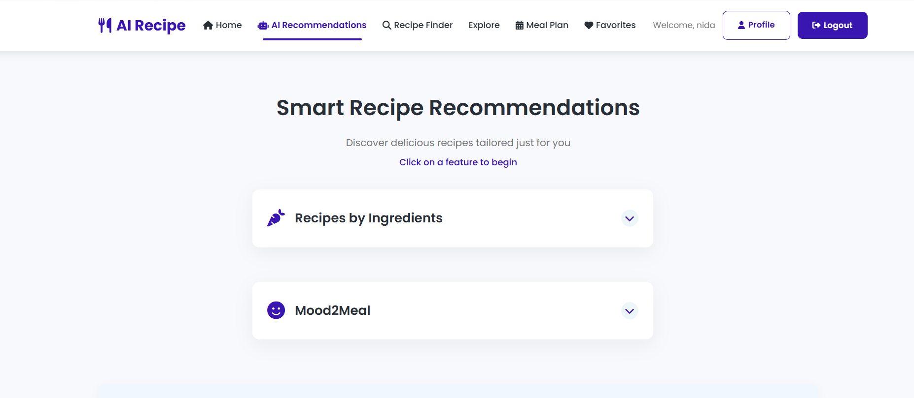

# 🍽️ AI-Powered Recipe Recommender

A full-stack Django-based web application that recommends recipes based on user mood and available ingredients using AI techniques.

---

## 🚀 Features

- 🔍 Ingredient-based recipe recommendation
- 😊 Mood-based recipe suggestions (Mood2Meal)
- 👤 User authentication & profiles
- ❤️ Save & favorite recipes
- 📅 Meal planner with shopping list
- 🌐 Community recipe sharing

---

## 🛠️ Tech Stack

- **Backend:** Django, Python  
- **Frontend:** HTML, CSS, Bootstrap  
- **Machine Learning:** TF-IDF, Cosine Similarity  
- **Database:** SQLite  

---

## ⚙️ Installation

```bash
git clone https://github.com/nidhazaina7/AI-Recipe-Recommendation.git
cd AI-Recipe-Recommendation
pip install -r requirements.txt
python manage.py runserver

---

## 📸 Screenshots

### 🏠 Home Page


### 🔍 Explore Recipes


### 📅 Meal Planner


### 👤 Profile Page


### 🤖 AI Recommendation

